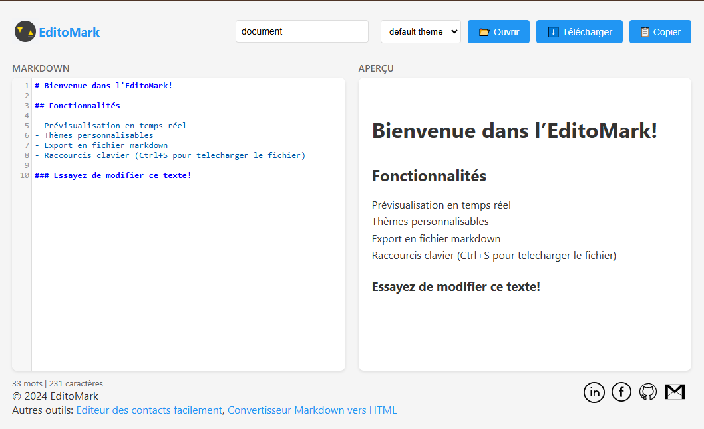

# EditoMark

**EditoMark** est un éditeur en ligne qui permet de convertir du texte écrit en [Markdown](https://fr.wikipedia.org/wiki/Markdown) en HTML, facilitant ainsi la création de contenu web.

## Fonctionnalités

- **Édition en temps réel** : Tapez votre texte en Markdown et visualisez instantanément le rendu HTML.
- **Thèmes personnalisables** : Choisissez parmi une variété de thèmes pour personnaliser l'apparence de l'éditeur.
- **Téléchargement facile** : Téléchargez votre contenu au format `.md` ou `.html` en un clic.
- **Copie rapide** : Copiez le code HTML généré directement dans votre presse-papiers.

## Utilisation

1. **Saisie** : Entrez votre texte en Markdown dans le panneau de gauche intitulé "MARKDOWN".
2. **Aperçu** : Visualisez le rendu HTML en temps réel dans le panneau de droite intitulé "APERÇU".
3. **Personnalisation** : Sélectionnez votre thème préféré dans le menu déroulant en haut de la page.
4. **Téléchargement** : Cliquez sur le bouton "⬇️ Télécharger" pour sauvegarder votre travail en `.md` ou `.html`.
5. **Copie** : Utilisez le bouton "Copier" pour copier le code HTML généré dans votre presse-papiers.

## Thèmes Disponibles

- Abbott
- Ambiance
- Ayu Dark
- Ayu Mirage
- Blackboard
- Monokai

## Démo

Découvrez l'application en ligne : [EditoMark](https://emmadiblo.github.io/editomark/)

## Capture d'écran

